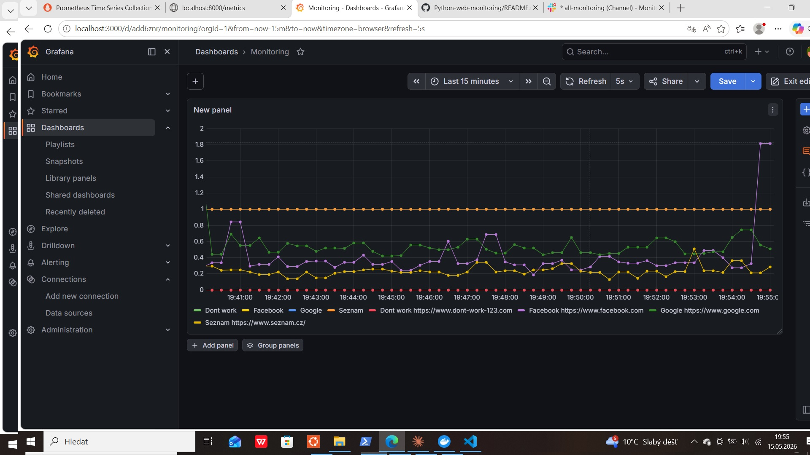

## Dashboard Preview

# Web Monitoring System

A simple website monitoring system written in Python.

The project regularly checks the availability of selected websites, measures response time, writes results to a log file, sends Slack alerts when a website is unavailable, and exposes metrics for Prometheus. The data is then displayed in a Grafana dashboard. The log file is also uploaded to AWS S3.

## Technologies Used

- Python
- Requests
- Prometheus Client
- Prometheus
- Grafana
- Docker Compose
- Slack Webhook
- AWS S3
- dotenv / `.env` configuration

## Features

- Website availability monitoring
- Response time measurement
- Slack alerts when a website is down
- Prometheus metrics
- Grafana dashboard
- Log upload to AWS S3
- Secure configuration using `.env`

  # Web Monitoring System

Jednoduchý monitoring webových stránek napsaný v Pythonu.

Projekt pravidelně kontroluje dostupnost vybraných webů, měří dobu odezvy, zapisuje výsledky do logu, odesílá upozornění do Slacku při výpadku a vystavuje metriky pro Prometheus. Data jsou následně zobrazena v Grafana dashboardu. Log soubor je zároveň nahráván do AWS S3.

## Použité technologie

- Python
- Requests
- Prometheus Client
- Prometheus
- Grafana
- Docker Compose
- Slack Webhook
- AWS S3
- dotenv / .env konfigurace

## Funkce

- kontrola dostupnosti webů
- měření odezvy
- Slack alert při výpadku
- Prometheus metriky
- Grafana dashboard
- upload logů do AWS S3
- bezpečné ukládání konfigurace přes `.env`
